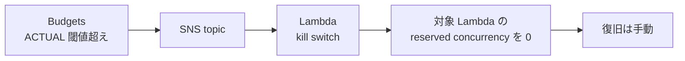

## 予算を超えたら全部止まる仕組みを Terraform で作った

個人開発で AWS を使っていて一番怖いのは、寝ている間に請求が伸びていることです。
対戦タイピングゲームを AWS で動かしているので、**実支出が決めた額を超えたら
全 Lambda を止める**構成を Terraform で書きました。

構成は 3 層です。

| 層 | 何をするか | 効き方 |
|---|---|---|
| 層 1 | API Gateway で rate / burst を制限 | コストが**増える速度**に上限をかける |
| 層 2 | Budgets で段階的に通知 | 気づく |
| 層 3 | 実支出が閾値を超えたら全 Lambda の同時実行数を 0 に | 止める |

:::message
AWS の料金体系と各サービスの仕様は変わります。この記事の仕様に関する記述は
2026-10 時点で公式ドキュメントを確認したものです。導入前に必ず最新版を見てください。
:::

## 1 層だけでは守れない

はじめは Budgets のメール通知だけ置いていました。これは**気づくための仕組み**であって、
止める仕組みではありません。しかも Budgets の更新頻度には上限があります。

> AWS Budgets information is updated up to three times a day. Updates typically occur 8–12 hours after the previous update.
> — [Managing your costs with AWS Budgets](https://docs.aws.amazon.com/cost-management/latest/userguide/budgets-managing-costs.html)

**1 日 3 回まで、間隔は 8〜12 時間**です。同じページには、課金が発生してから通知が
届くまでに遅延があり、通知される前に閾値を超えた分が積み上がる可能性も明記されて
います。

> You might incur additional costs or usage that exceed your budget notification threshold before AWS Budgets can notify you

つまり **Budgets を起点にした仕組みは、原理的に後手**です。閾値を超えた瞬間に
止まるわけではありません。ここが分かったことで、層 1 を置く理由がはっきりしました。
止める層がどうしても遅れるなら、**そもそも増える速度を抑えておく**しかありません。

整理すると、層 1 とそれ以外では守っているものが違います。

- **層 1 だけがリアルタイム**で、秒単位で spike を頭打ちにする。増える量そのものを決める
- **層 2 と層 3 は同じ Budgets の更新に乗っている**ので、反応の速さは変わらない。
  違うのは、人が判断して動くか、人を介さず止まるか

層 2 と層 3 を分けているのは速さのためではありません。**夜中に自分が寝ていても
止まる経路**が要るから層 3 を足した、というだけです。

## 層 1: API Gateway で「増える速度」に上限をかける

Lambda の課金は呼ばれた回数と時間で決まります。だから入口で呼ばれる回数を抑えるのが
一番直接的です。API Gateway v2 のステージに、全ルート共通の throttle をかけています。

```hcl:apigateway.tf
resource "aws_apigatewayv2_stage" "http_default" {
  api_id      = aws_apigatewayv2_api.http.id
  name        = "$default"
  auto_deploy = true

  # 全ルート共通のレート制限。これを超える spike は 429 で返して
  # コスト増加速度の上限を保証する。
  default_route_settings {
    throttling_burst_limit = var.default_burst_limit
    throttling_rate_limit  = var.default_rate_limit
  }
```

さらに、**未認証で叩けるルートだけ個別に厳しく**しています。

```hcl:apigateway.tf
  # 未認証で叩けるルートは、軽い bot 攻撃でも Lambda invoke がスパイクしうる。
  # default より厳しめの route 単位 throttle を別途かける。
  route_settings {
    route_key              = "GET /<未認証ルート>"
    throttling_burst_limit = var.public_burst_limit
    throttling_rate_limit  = var.public_rate_limit
  }
```

**公開されていて認証が要らないルートが、コスト上の一番弱い場所です。** ログインが
要るルートは、攻撃するにもアカウントが要ります。認証なしで叩けるルートは誰でも
好きなだけ呼べます。ここだけ別扱いにするのは、設定の手間に対して効果が大きい部分です。

該当ルートには短い in-memory キャッシュも挟んでいます。同じ秒間に何度呼ばれても
バックエンドへの問い合わせは 1 回で済むので、厳しめの rate でも実用上困りませんでした。

## 層 2: 段階的に知らせる

`aws_budgets_budget` を 1 本置いて、通知を 4 段階に分けています。

```hcl:budgets.tf
resource "aws_budgets_budget" "monthly" {
  name         = "${var.app_name}-monthly"
  budget_type  = "COST"
  limit_amount = tostring(var.monthly_budget_usd)
  limit_unit   = "USD"
  time_unit    = "MONTHLY"

  # "傾向を確認" レベルの 50% notify。SNS 経由で email に届く。
  notification {
    comparison_operator        = "GREATER_THAN"
    threshold                  = 50
    threshold_type             = "PERCENTAGE"
    notification_type          = "ACTUAL"
    subscriber_sns_topic_arns  = [aws_sns_topic.cost_alerts.arn]
    subscriber_email_addresses = var.alert_emails
  }
  # 80% / 100% / FORECASTED も同じ形で 3 つ追加する
}
```

ここで意図的にやっているのは、**段階を分けること**です。100 % だけに通知を置くと、
届いた時点で予算を使い切っています。50 % の通知は「今月ちょっと多いな」を知るためで、
行動を要求しません。80 % が「何か起きている」の合図です。

`FORECASTED` を入れているのは、月末の着地予想で先に気づけるからです。実支出ベースの
通知だけだと、月初に急に伸びた場合に手遅れになります。

## SNS の topic policy が無いと通知は silent に失敗する

ここが一番ハマったところです。Budgets から SNS topic に publish させるには、
**topic 側で `budgets.amazonaws.com` を明示的に許可**する必要があります。

```hcl:budgets.tf
# AWS Budgets がこの topic に publish するには明示的な権限が必要。
# これが無いと通知は silent に失敗する。
resource "aws_sns_topic_policy" "cost_alerts" {
  arn = aws_sns_topic.cost_alerts.arn
  policy = jsonencode({
    Version = "2012-10-17"
    Statement = [{
      Effect    = "Allow"
      Principal = { Service = "budgets.amazonaws.com" }
      Action    = "sns:Publish"
      Resource  = aws_sns_topic.cost_alerts.arn
    }]
  })
}
```

これを忘れると、**`terraform apply` は通るし、Budgets の画面上も正常に見えるのに、
通知だけが来ません**。エラーがどこにも出ないので、気づく手段が「来るはずの通知が
来ないことに気づく」しかありません。コスト防御の仕組みが黙って壊れているのは
一番避けたい状態です。

公式にも専用のページがあります。

@[card](https://docs.aws.amazon.com/cost-management/latest/userguide/budgets-sns-policy.html)

もう 1 つ、email の subscription は **各アドレスで AWS からの確認メールに応答するまで
有効になりません**。Terraform 側は `pending confirmation` のまま正常終了します。

```hcl:budgets.tf
# AWS からの confirmation メールに各アドレスで応答しないと有効化されない。
resource "aws_sns_topic_subscription" "cost_alerts_email" {
  for_each  = toset(var.alert_emails)
  topic_arn = aws_sns_topic.cost_alerts.arn
  protocol  = "email"
  endpoint  = each.value
}
```

通知系はどれも「設定した気になって届かない」が起きやすいので、**作ったあとに一度
手で発火させて、実際に届くか確かめる**のが確実です。

## 層 3: 閾値を超えたら全 Lambda の同時実行数を 0 にする

最終防衛です。流れはこうなっています。



止める実体は Python の 20 行ほどです。`PutFunctionConcurrency` で同時実行数を 0 に
するだけで、Lambda は呼ばれなくなります。

```python:kill_switch.py
def handler(event, _context):
    targets = [t.strip() for t in os.environ.get("TARGETS", "").split(",") if t.strip()]
    results = []
    for fn in targets:
        try:
            _lambda.put_function_concurrency(
                FunctionName=fn,
                ReservedConcurrentExecutions=0,
            )
            results.append({"function": fn, "status": "disabled"})
        except Exception as exc:
            results.append({"function": fn, "status": "error", "error": str(exc)})
```

対象は Terraform 側で列挙して環境変数で渡しています。**新しい Lambda を足したら
ここに追加しないと、その関数だけ止まりません。** 増えるたびに追従が必要なので、
ここは設計上の弱点として自覚しています。

```hcl:kill_switch.tf
locals {
  # Kill switch で止める対象。新しい Lambda を足したらここに追加必須。
  kill_switch_targets = [
    aws_lambda_function.<各関数>.function_name,
    # ...
  ]
}
```

IAM は `lambda:PutFunctionConcurrency` を**対象関数の ARN だけ**に絞っています。
止める以外のことはできません。コスト防御のために置いた Lambda が、権限過多で
別のリスクになっては意味がないので、ここは狭くしています。

```hcl:kill_switch.tf
{
  Effect   = "Allow"
  Action   = ["lambda:PutFunctionConcurrency"]
  Resource = [for f in local.kill_switch_targets :
    "arn:aws:lambda:${var.region}:${data.aws_caller_identity.current.account_id}:function:${f}"]
}
```

### 失敗したら例外を投げる

`kill_switch.py` は、1 つでも停止に失敗したら例外を投げるようにしています。

握り潰して 200 を返すと SNS はリトライしません。**本来止めたかった Lambda が
走り続けているのに、仕組みとしては成功扱い**になります。コスト防御が黙って
崩壊する形なので、例外を投げて SNS のリトライに任せ、Lambda の Errors アラームにも
拾わせています。

通知が silent に失敗する話と同じで、**防御の仕組みは「壊れたときに気づけるか」まで
作らないと意味がない**という点が共通しています。

## Budget Actions では作れなかった

AWS Budgets には **Budget Actions** という「閾値を超えたら何かする」機能があります。
やりたいことそのままの名前なので最初に調べましたが、**今回の用途では使えませんでした**。

公式ドキュメントで提供されているアクションは次の 3 種類です。

| アクション | 内容 |
|---|---|
| IAM ポリシー適用 | ユーザー / グループ / ロールに Deny を当てる |
| SCP 適用 | Organizations 配下のアカウントに制限をかける |
| EC2 / RDS インスタンス指定 | 特定インスタンスを停止する |

> Your available actions include applying an IAM policy or a service control policy (SCP). They also include targeting specific Amazon EC2 or Amazon RDS instances in your account.
> — [Configuring budget actions](https://docs.aws.amazon.com/cost-management/latest/userguide/budgets-controls.html)

**Lambda を止めるアクションはありません。** 任意の SSM ドキュメントを実行する枠も
用意されていないので、Lambda を対象にしたい場合は自分で経路を作る必要があります。

そこで **Budgets → SNS → Lambda** にしました。Budgets は SNS に publish できるので、
あとは SNS から自分の Lambda を呼ぶだけです。遠回りに見えますが、Budgets の機能で
賄える範囲を超えた時点でこれが一番素直でした。

なお料金ページを読むと、無料枠の対象は **Budget Actions を設定した予算**です。

> Your first two action-enabled budgets are free (regardless of the number of actions you configure per budget) per month.
> — [AWS Budgets pricing](https://aws.amazon.com/aws-cost-management/aws-budgets/pricing/)

通常の予算監視と通知自体には課金されません。この構成は Budget Actions を使わず
SNS 通知だけなので、**action-enabled の無料枠は消費していない**ことになります。
「予算を増やすと課金される」と思い込んで本数を節約していたのですが、
通知だけなら増やしても構いませんでした。

## 自動で復旧させないことにした

止まったあと、支出が落ち着いたら自動で戻す、という作りにはしていません。
復旧は**管理者が明示的に実行**します。

**自動で戻ると、知らない間にまた動き出して再び課金が走る**からです。
kill switch が発火したということは、想定外のことが起きたということです。原因を
見ないまま再開するのは、仕組みを置いた意味を打ち消します。

片方向にしておけば、発火したときは必ず人が確認することになります。個人開発なので
サービスが数時間止まっても誰も困りません。**止まる不便さと、気づかず課金され
続ける怖さを比べて、前者を選びました。**

ここは事業の性質で答えが変わるところだと思います。売上が立っているサービスなら
逆の判断になるはずです。

## kill switch 自身のログもコスト削減の対象にした

kill switch の CloudWatch Logs も、他の Lambda と同じ条件にしています。

```hcl:kill_switch.tf
resource "aws_cloudwatch_log_group" "kill_switch" {
  name              = "/aws/lambda/${aws_lambda_function.kill_switch.function_name}"
  retention_in_days = 1
  log_group_class   = "INFREQUENT_ACCESS"
}
```

コスト防御のために置いた仕組みが課金を増やしていたら本末転倒なので、
**防御側も同じ基準で絞る**ようにしました。

CloudWatch Logs は**保存期間を指定しないと無期限保存**になります。Terraform で
Lambda を作るとロググループは暗黙に作られるので、`aws_cloudwatch_log_group` を
明示的に書いていないと、ここが静かに溜まり続けます。個人開発では特に効きます。

## まとめ

- 個人開発の AWS に、**増える速度を抑える / 気づく / 止める** の 3 層を Terraform で置いた
- Budgets の更新は **1 日 3 回・間隔 8〜12 時間**。止める仕組みは原理的に後手なので、
  入口で速度を抑える層とセットでないと機能しない
- Lambda を止めるのに **Budget Actions は使えない**（IAM / SCP / EC2・RDS のみ）。
  Budgets → SNS → Lambda で `PutFunctionConcurrency` を 0 にした
- `aws_sns_topic_policy` を忘れると **通知が silent に失敗する**。
  通知系は作ったあとに一度手で発火させないと、効いているか分からない

まず 1 つだけ置くなら、**未認証で叩けるルートの throttle** をお勧めします。
設定は数行で、依存するリソースもありません。

書いてみて気づいたのは、層 2 と層 3 は「起きてしまった後」をどう縮めるかの話で、
**起きる量そのものを決めているのは層 1 だけ**だということです。Budgets の通知を
置いただけで安心していたときは、ここが抜けていました。

## 参考リンク

- [Managing your costs with AWS Budgets](https://docs.aws.amazon.com/cost-management/latest/userguide/budgets-managing-costs.html) — 更新頻度と通知遅延
- [Configuring budget actions](https://docs.aws.amazon.com/cost-management/latest/userguide/budgets-controls.html) — Budget Actions で何ができるか
- [Creating an Amazon SNS topic for budget notifications](https://docs.aws.amazon.com/cost-management/latest/userguide/budgets-sns-policy.html) — topic policy の書き方
- [AWS Budgets pricing](https://aws.amazon.com/aws-cost-management/aws-budgets/pricing/) — action-enabled budget の無料枠
- [PutFunctionConcurrency](https://docs.aws.amazon.com/lambda/latest/api/API_PutFunctionConcurrency.html) — 同時実行数を 0 にする API
- [Throttling requests to your HTTP API](https://docs.aws.amazon.com/apigateway/latest/developerguide/http-api-throttling.html) — API Gateway の rate / burst
