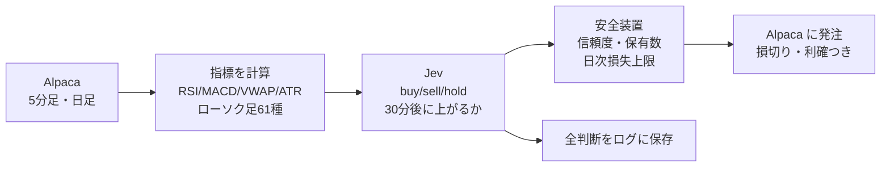

## はじめに

2026年9月に公開されて話題になった、TypeSafe AI の判断特化モデル「Jev」。文章を生成せず、**選択肢から1つを選ぶ・点数をつける・Yes/Noの確率を返す**ことだけに特化していて、0.1〜0.5秒で答えが返ってきます。料金は入力100万トークンあたり0.042ドル（執筆時点）と、とても安いです。

「速くて安い判断AIなら、株の自動売買に向いているのでは？」と思い、Alpaca のペーパートレード（仮想資金）で試しました。実装と検証は Claude Code と一緒に進めています。

**結論から書くと、試した4つの方法のどれでも、売買コストを上回る有利さは確認できませんでした。** 仮想資金100,000ドルで2日間売買させた結果は、**−626ドル（−0.63%）**です。この記事では、何をどう試し、どう評価して「勝てない」と判断したかをまとめます。

:::message
この記事は技術的な実験の記録で、投資の勧誘や助言、特定の銘柄の売買を勧めるものではありません。すべてペーパートレード（仮想資金）での結果で、過去の結果は将来の成績を保証しません。
:::

## Jev とは

Jev には3種類の質問ができます。

| 種類 | 答え | 使い方の例 |
|---|---|---|
| Choice | 選択肢から1つ＋各選択肢の確率＋信頼度 | buy / sell / hold |
| Score | 順序のある段階から1つ＋確率 | とても悪い〜とても良い の5段階 |
| Noul | Yes の確率（0〜1） | 30分後に上がっているか |

Python SDK では、判断材料（`state`）と質問（`questions`）を渡すだけです。1回の呼び出しで複数の質問をまとめて聞けます。

```python
from typesafe_sdk import Choice, Noul, TypeSafeClient

client = TypeSafeClient()  # 環境変数 TYPESAFE_API_KEY を読む
response = client.system_one(
    model="jev-latest",
    state=state,  # 指標などを入れた dict
    questions={
        "action": Choice(
            instructions="Choose the best action for the next 30 minutes...",
            criteria={"buy": None, "sell": None, "hold": None},
        ),
        "up_30m": Noul(instructions="Will the price be higher 30 minutes from now?"),
    },
)
response.choices["action"].choice        # "buy"
response.choices["action"].confidence    # 0.72
response.nouls["up_30m"].noul            # 0.53
```

## 作ったもの



- **元手**: Alpaca のペーパー口座の初期資金 100,000ドル（仮想資金）
- **対象**: S&P500 の全銘柄＋Nasdaq-100 の主な銘柄＋ETF、計535銘柄
- **頻度**: 取引時間中に5分ごと。1サイクルは約50秒（株価データの取得が約45秒、Jev の判断が約7秒）
- **Jev への入力**: 5分足の指標、日足の指標、ローソク足パターン（TA-Lib の61種類を計算して名前で渡す）、SPY・QQQ の状況、保有状況
- **売買**: 買いのみ。1銘柄5,000ドル・最大10銘柄。損切り・利確は ATR（値動きの幅）の2倍・3倍でブラケット注文。保有60分で手仕舞い、引けの15分前に全決済
- **ログ**: 全銘柄・全サイクルの入力と Jev の回答を gzip の JSONL で保存（1サイクル約86KB）

Jev は計算が苦手とされているので、指標やパターンの判定はすべて Python 側で済ませ、**計算済みの値と名前だけ**を渡しています。

## 結果1: 2日間のペーパートレード

元手100,000ドル（仮想資金）での結果です。

| | 1日目（途中から約2.5時間） | 2日目（約3時間で停止） |
|---|---|---|
| 損益 | −186ドル（−0.19%） | −440ドル（−0.44%） |
| 同じ時間帯の SPY | −0.27% | −0.29% |
| 決済（勝ち/負け） | 6 / 24 | 4 / 35 |
| 損切りの発動 | 9件 −110ドル | 16件 −315ドル |
| 利確の成立 | 0件 | 1件 |


*2日目（米国時間9/29）の口座。日本時間22:30の取引開始から下がり続け、−439.78ドル（−0.44%）で売買を止めた*

2日間の合計は−626ドル（−0.63%）です。2日とも市場全体が下げていた時間帯でした。ただし、投じていたのは最大でも元手の半分（10銘柄×5,000ドル）です。投じた金額に対する損失の割合で見ると、SPY の下げを上回っており、下げ相場だけでは説明がつかない負け方でした。

### Jev の予測を実際の値動きと突き合わせる

Jev の「30分後に上がる確率」と、実際の30分後の値動きを照合しました。評価には **AUC** を使っています。予測の高い順に並べたとき、実際に上がったものが上に来ているかを表す指標で、0.5なら当てずっぽうと同じです。

| | 1日目 | 2日目 |
|---|---|---|
| 「30分後に上がる」確率の AUC | 0.478 | **0.445** |
| Jev が buy と言った銘柄の30分後 | −0.04% | −0.22% |
| 何もしなかった（hold）銘柄の30分後 | −0.04% | −0.07% |
| 買いの信頼度 0.7 以上の銘柄 | −0.07% | —（該当なし） |

**信頼度が高いほど成績が悪い**という、逆の関係になっていました。

### なぜ逆になったのか

Jev に渡していた指標を1つずつ取り出し、単独で30分後をどれだけ予測できていたかも測りました。

| 指標 | AUC（1日目） |
|---|---|
| 直近15分・30分の値動き、MACD、ボリンジャーバンドの位置 | 0.45〜0.46 |
| 5日間の値動き、日足移動平均との差 | 0.53〜0.55 |
| Jev の「上がる確率」 | 0.478 |

0.5を下回るのは「逆に使えば当たる」という意味です。直前に上がった銘柄ほど、その後の30分で下がっていました（短期の反動）。Jev は教科書どおり「直前に上がった＝強い」と判断していて、それが逆に働いていました。

## 結果2: プロンプトで改善できるか

ログに全入力を保存していたので、**過去の入力を別のプロンプトで Jev に答え直させて比べる**ことができます。1日目のログから2,000件を抜き出して試しました（費用は1回約0.2ドル）。

| 案 | 1日目（作った日） | 2日目（別の日で確認） |
|---|---|---|
| A. 元のプロンプト | 0.48 | 0.44 |
| B. 「SPYより上がるか」と聞く | 0.53 | 0.46 |
| C. 見方を教えて「SPYより上がるか」と聞く | 0.55 | **0.55** |
| D. Cに加えて指標を10個に絞る | 0.55 | **0.57** |
| 参考: Jev なしの逆張りルール（直近15分の値動きの逆） | 0.55 | 0.57 |
| 参考: Jev なしの勢いルール（5日間の値動き） | 0.55 | 0.46 |

C の「見方」は、「30分程度なら、直前の急な動きは戻りやすい」「数日単位の傾向は続きやすい」「5分足のローソク足パターンは弱いシグナル」という内容をプロンプトに書いたものです。

1日目のデータで作ったプロンプトを、**2日目という別の日で確かめる**ことが大事でした。「逆張り」の見方は別の日でも通用しましたが、「勢い」の見方は通用しませんでした。

ただ、改善後の Jev（案D）は、**Jev を使わない1行のルールとほぼ同じ成績**です。Jev は教えた見方どおりに判断するようになっただけで、上乗せは見えませんでした。

### 売買でシミュレーションすると

「毎サイクル、点数の高い上位5銘柄を買って30分後に売る」を、2日分のデータで試算しました（片道0.03%のコストを含む）。

| 選び方 | 1取引の平均 | 勝率 |
|---|---|---|
| 元の Jev | −0.21% | 30% |
| 改善後の Jev | −0.16% | 38% |
| 逆張りルール | −0.15% | 46% |
| **無作為に選ぶ** | **−0.13%** | 33% |

**改善後の Jev でも、無作為に選んだ場合を上回れませんでした**（差は誤差の範囲に近い程度です）。当たり外れの順位づけ（AUC）が良くなっても、上位に来るのは直前に大きく動いた値動きの荒い銘柄で、外れたときの損が大きかったためです。そもそも30分の値動きから読み取れる差が、往復0.06%のコストより小さいことが根本的な問題でした。

## 結果3: ニュースを読ませる

Jev の本来の得意分野は、文章を読んで分類することです。そこで、Alpaca が無料で配信している Benzinga のニュースを使い、**2026年7〜9月の約2.1万件**を Jev に読ませました（費用0.5ドル）。

質問は3つです。

- 株価を動かしうる、会社固有のニュースか（「5年前に買っていたら今いくら」のような自動生成記事を除くため）
- 今後数日の株価への影響（とても悪い〜とても良い の5段階）
- 市場の予想に比べてどのくらい大きな話か（小・中・大）

「中身がある」と判断された約1.3万件について、**ニュース公開後の最初の寄り付きで買い、1・3・5日後の終値で売った場合**の SPY との差を測りました。

| Jev の見立て | 件数 | 1日後 | 3日後 | 5日後 |
|---|---|---|---|---|
| とても悪い・悪い | 2,577 | +0.21% | +0.43% | +0.55% |
| 中立 | 2,347 | +0.01% | +0.15% | +0.24% |
| 良い | 7,466 | −0.09% | −0.18% | −0.06% |
| とても良い | 481 | +0.60% | +0.95% | +1.13% |

全体の AUC は0.48で、「悪い」ニュースの銘柄のほうがその後上がっていました。業績の下方修正のような悪いニュースは寄り付きで一気に下がる（窓を開けて下落する）ので、そこで買うと、**下がりすぎの戻りを拾う**形になるためです。

「とても良い」だけは良い成績に見えますが、月別に分けると印象が変わります。

| 「とても良い」の1日後 | 7月 | 8月 | 9月 | 9/15以降（Jev の公開後） |
|---|---|---|---|---|
| SPY との差 | −0.16% | **+1.77%** | −0.02% | −1.23%（43件） |

プラスだったのは決算シーズンの8月だけでした。また、Jev の公開より前のニュースは、Jev が学習の段階で結末まで知っている可能性があります。その影響を受けない9/15以降では、マイナスでした。

## 結果4: ニュースに1〜5分で反応する

Jev の強みは速さなので、「翌寄り付き」では遅すぎるのかもしれません。取引時間中に出たニュース約5,700件について、**公開の1分後・5分後の1分足で買った場合**を検証しました。Jev の回答は保存済みのものを使ったので、追加費用はかかっていません。

| 保有時間 | 5分 | 15分 | 30分 | 引けまで |
|---|---|---|---|---|
| AUC（公開1分後に買った場合） | 0.514 | 0.505 | 0.510 | 0.508 |

どの保有時間でも当てずっぽうと区別がつきませんでした。9/15以降の「とても良い」ニュースは、**買う前（公開から1分以内）にすでに+0.53%動いていて**、その後は下がっていました。大きなニュースは、1分もたたずに株価に織り込まれています。

## 学んだこと

**1. 「Jev が正しく読めるか」と「儲かるか」は別の問題**
目で確認した範囲では、Jev はニュースの良し悪しを妥当に分類していました。ただ、株価はその情報をすでに反映して動いているので、正しく分類できても利益にはつながりませんでした。

**2. 必ず Jev なしの単純なルールや無作為と比べる**
プロンプトを変えて AUC が0.48から0.57に上がったときは、うまくいったように見えました。ところが、同じ見方を1行で書いたルールや無作為の選択と比べると、上乗せがないことがわかりました。

**3. 作った日と別の日で確かめる**
1日目のデータで作ったプロンプトは、1日目で良く見えて当然です。別の日で確かめると、「逆張り」は残り、「勢い」は崩れました。

**4. 当たり具合と損益は別物**
AUC が0.55あっても、上位の銘柄が荒く動くと、平均の損益では負けます。30分程度の値動きでは、狙える差がコストより小さくなりがちです。

**5. 評価できるログを最初から残す**
全入力と回答を保存していたおかげで、プロンプトの比較や売買のシミュレーションを、待たずに過去データで回せました。

### ほかの注意点

- 検証には Alpaca の無料データ（リアルタイムは IEX フィード）を使いました。IEX は米国全体の出来高の数%しか含まないので、出来高系の指標は参考値です
- 執筆時点の米国のパターンデイトレーダー規制では、口座残高が25,000ドル未満だと、日計り取引は5営業日で3回までです。少額でこの種のボットを実運用するのは難しいです
- ニュースの検証は3か月分ですが、運用は2日分だけで、2日とも下げ相場でした

## 費用

| 項目 | 金額 |
|---|---|
| Jev（535銘柄の5分ごとの判断・2日分） | 約1.45ドル |
| Jev（プロンプトの比較とシミュレーション） | 約0.8ドル |
| Jev（ニュース約2.1万件の分類） | 約0.5ドル |
| Alpaca（ペーパー口座・データ・ニュース） | 無料 |

535銘柄を5分ごとに判断しても、1日あたり約2ドルでした。Jev の安さは本物です。

## まとめ

- 判断特化 AI の Jev に、米国株を4つの方法で判断させた
- 仮想資金100,000ドルでの2日間のペーパートレードは、−626ドル（−0.63%）
- 5分足の指標からの予測は、逆の目印になっていた（AUC 0.44〜0.48）
- プロンプトの改善で AUC は0.57まで上がったが、単純なルールと同程度で、コスト後は無作為を上回れなかった
- ニュースの読解は妥当でも、寄り付き時点・1分後の時点では、すでに株価に織り込まれていた

今回の条件・期間では、Jev の速さと安さは魅力的でも、「速く正しく判断できる」ことと「市場で勝てる」ことの間には、大きな距離がありました。
