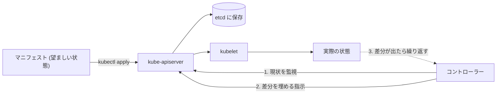
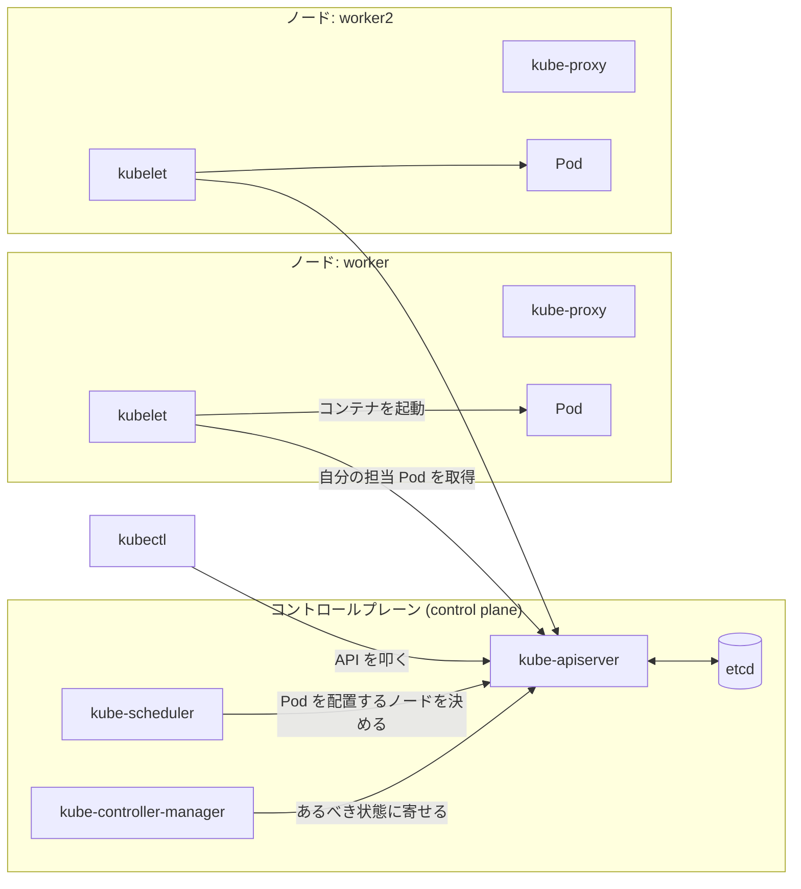
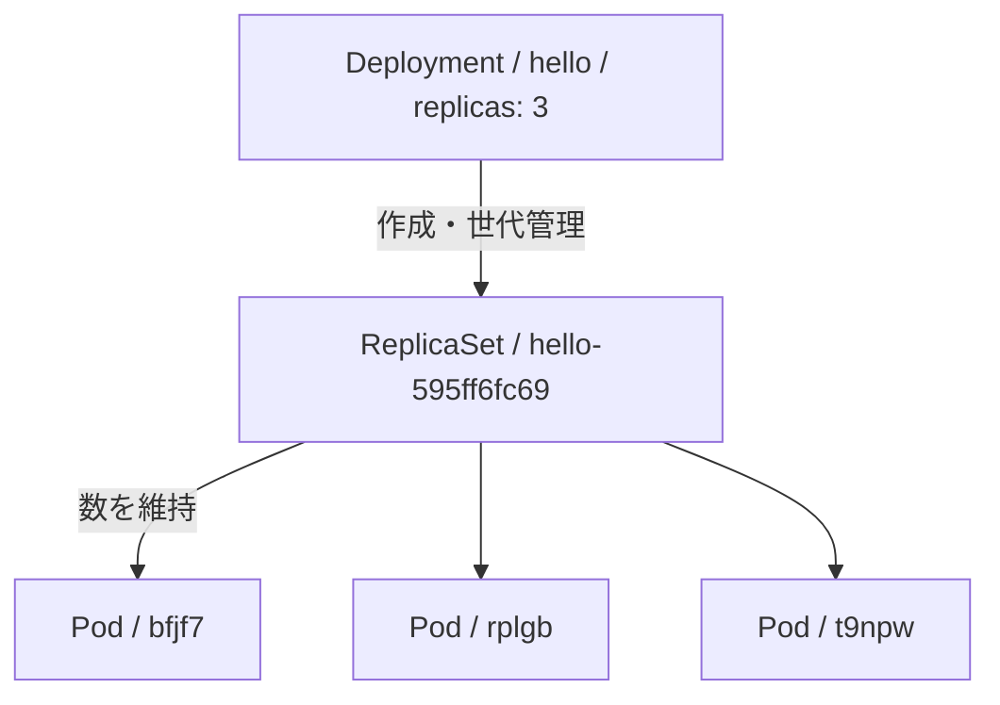
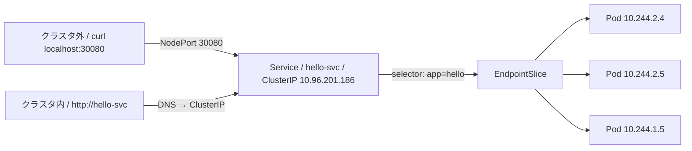
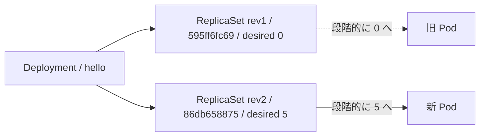

## 手元にクラスタを立てて動かす

Kubernetes の入門記事です。読み終わると、手元の Docker 上に 3 ノードのクラスタが立ち、Pod / Deployment / Service / ConfigMap / Secret を一通り触った状態になります。

掲載したコマンドの出力は、下の環境で実際に流したものです。

| | |
|---|---|
| OS | macOS(Darwin 25.6.0 / arm64) |
| Docker | 28.3.0(Docker Desktop) |
| kind | v0.32.0 |
| kubectl | v1.36.2 |
| クラスタ | Kubernetes **v1.36.1**(`kindest/node:v1.36.1`、control-plane 1 + worker 2) |

なお Kubernetes がサポートしているのは**最新 3 マイナーバージョン**です。この記事を書いている 2026-10 時点では 1.37 / 1.36 / 1.35 がサポート対象で、1.34 は 2026-10-27 にサポートが切れます。

サポート対象のバージョンは公式の[リリース一覧](https://kubernetes.io/ja/releases/)で確認できます。

:::message
引用はすべて公式ドキュメントの**日本語版**(`kubernetes.io/ja/`)から取り、リンク先も日本語版にしています。日本語版が未翻訳の箇所は、引用せずに本文で説明しています。
:::

---

## 1. Kubernetes とは何か

公式の定義はこれです。

> Kubernetesは、宣言的な構成管理と自動化を促進し、コンテナ化されたワークロードやサービスを管理するための、ポータブルで拡張性のあるオープンソースのプラットフォームです。
> — [Kubernetesとは何か？ | Kubernetes](https://kubernetes.io/ja/docs/concepts/overview/)

名前の由来も公式に書かれています。

> Kubernetesの名称は、ギリシャ語に由来し、操舵手やパイロットを意味しています。"K"と"s"の間にある8つの文字を数えることから、K8sが略語として使われています。Googleは2014年にKubernetesプロジェクトをオープンソース化しました。
> — [Kubernetesとは何か？ | Kubernetes](https://kubernetes.io/ja/docs/concepts/overview/)

「K8s」は K と s の間が 8 文字だから、です。

### 宣言的 (declarative) というのが肝

定義の中の **declarative configuration** が Kubernetes の中心にある考え方です。

`docker run` は「**いまコンテナを起動せよ**」という命令です。対して Kubernetes には「**この状態であってほしい**」を書いて渡します。あとはコントローラーが現状を監視し続け、ズレていたら埋めます。この繰り返しが Kubernetes の動作原理です。



だから「Pod が 3 つ動いていてほしい」と宣言しておけば、1 つ落ちても勝手に作り直されます。これは後で実際に消して確かめます。

---

## 2. クラスタの構造

Kubernetes クラスタは **コントロールプレーン**（頭脳）と **ノード**（実際にコンテナが動く場所）に分かれます。



図の中で**すべてが `kube-apiserver` を経由している**のがポイントです。コンポーネント同士が直接話すことはなく、API サーバーと etcd を介してやり取りします。

### コントロールプレーンのコンポーネント

クラスター全体の状態を管理します。

| コンポーネント | 公式の説明 |
|---|---|
| **kube-apiserver** | 「Kubernetes HTTP APIを公開するコアコンポーネントサーバーです。」 |
| **etcd** | 「APIサーバーのすべてのデータを保存する、一貫性と高可用性を兼ね備えたキーバリューストアです。」 |
| **kube-scheduler** | 「まだノードにバインドされていないPodを検出し、それぞれのPodを適切なノードに割り当てます。」 |
| **kube-controller-manager** | 「コントローラーを実行して、Kubernetes APIの動作を実装します。」 |
| **cloud-controller-manager**（オプション） | 「基盤となるクラウドプロバイダーと統合します。」 |

### ノードのコンポーネント

すべてのノードで実行され、実行中のPodを維持し、Kubernetesランタイム環境を提供します。

| コンポーネント | 公式の説明 |
|---|---|
| **kubelet** | 「コンテナを含むPodが稼働していることを保証します。」 |
| **kube-proxy**（オプション） | 「ノード上のネットワークルールを維持し、Serviceを実装します。」 |
| **コンテナランタイム** | 「コンテナを実行する役割を持つソフトウェアです。」 |

いずれも出典は [Kubernetesのコンポーネント | Kubernetes](https://kubernetes.io/ja/docs/concepts/overview/components/) です。

---

## 3. 手元にクラスタを作る

学習用のクラスタには **kind** を使います。Docker コンテナ 1 つを 1 ノードに見せる作りです。

kind は Docker コンテナを「ノード」に見せかけてローカルに Kubernetes クラスタを立てるツールです。もともと Kubernetes 自体のテスト用に作られたもので、ローカル開発や CI にも使えます（出典: [kubernetes-sigs/kind](https://github.com/kubernetes-sigs/kind)。README は英語のみです）。

### インストール

```bash
# macOS (Homebrew)
brew install kind kubectl

# バージョン確認
kind version
kubectl version --client
```

Docker Desktop など、コンテナランタイムが起動している必要があります。

### クラスタの定義

1 ノードでも動きますが、**スケジューラがどのノードに Pod を置いたか**が見えるよう worker を 2 つ作ります。あとで NodePort を試すので、ホストの 30080 番をコントロールプレーンに通しておきます。

```yaml:kind-config.yaml
kind: Cluster
apiVersion: kind.x-k8s.io/v1alpha4
nodes:
  - role: control-plane
    extraPortMappings:
      - containerPort: 30080
        hostPort: 30080
        protocol: TCP
  - role: worker
  - role: worker
```

```bash
kind create cluster --name k8s-nyumon --config kind-config.yaml
```

```
Creating cluster "k8s-nyumon" ...
 ✓ Ensuring node image (kindest/node:v1.36.1) 🖼
 ✓ Preparing nodes 📦 📦 📦
 ✓ Writing configuration 📜
 ✓ Starting control-plane 🕹️
 ✓ Installing CNI 🔌
 ✓ Installing StorageClass 💾
 ✓ Joining worker nodes 🚜
Set kubectl context to "kind-k8s-nyumon"
```

### ノードを確認する

```bash
kubectl get nodes
```

```
NAME                       STATUS   ROLES           AGE    VERSION
k8s-nyumon-control-plane   Ready    control-plane   107s   v1.36.1
k8s-nyumon-worker          Ready    <none>          78s    v1.36.1
k8s-nyumon-worker2         Ready    <none>          78s    v1.36.1
```

作成直後は worker が `NotReady` に見えますが、CNI の初期化待ちなので放っておけば `Ready` になります。急ぐなら待てます。

```bash
kubectl wait --for=condition=Ready nodes --all --timeout=240s
```

### 2 節の図と実物を突き合わせる

`kube-system` ネームスペースを見ると、図に描いたコンポーネントがそのまま Pod として動いています。

```bash
kubectl get pods -n kube-system
```

```
NAME                                               READY   STATUS    RESTARTS   AGE
coredns-589f44dc88-p9frl                           1/1     Running   0          3m16s
coredns-589f44dc88-tq9mc                           1/1     Running   0          3m16s
etcd-k8s-nyumon-control-plane                      1/1     Running   0          83s
kindnet-fddnt                                      1/1     Running   0          58s
kindnet-mnn8f                                      1/1     Running   0          74s
kindnet-rw97k                                      1/1     Running   0          58s
kube-apiserver-k8s-nyumon-control-plane            1/1     Running   0          83s
kube-controller-manager-k8s-nyumon-control-plane   1/1     Running   0          83s
kube-proxy-bdhvv                                   1/1     Running   0          58s
kube-proxy-d9b7l                                   1/1     Running   0          58s
kube-proxy-hq5c5                                   1/1     Running   0          77s
kube-scheduler-k8s-nyumon-control-plane            1/1     Running   0          83s
```

読み取れること。

- `etcd` / `kube-apiserver` / `kube-controller-manager` / `kube-scheduler` は **コントロールプレーンのノードに 1 つずつ**
- `kube-proxy` と `kindnet`(kind の CNI)は **3 ノードぶん**。ノードごとに必要なので全ノードに配られます
- `coredns` はクラスタ内 DNS。6 節の Service 名前解決がこれで動きます

---

## 4. Pod

### 定義

> *Pod*は、Kubernetes内で作成・管理できるコンピューティングの最小のデプロイ可能なユニットです。
> — [Pod | Kubernetes](https://kubernetes.io/ja/docs/concepts/workloads/pods/)

> Pod とはクラスターで動作しているいくつかのコンテナのまとまりです。
> — [Pod（用語集）| Kubernetes](https://kubernetes.io/ja/docs/reference/glossary/?all=true#term-pod)

**コンテナではなく Pod が最小単位**です。Pod の中の複数コンテナはストレージとネットワークを共有します。

### 作ってみる

```yaml:pod.yaml
apiVersion: v1
kind: Pod
metadata:
  name: hello-pod
  labels:
    app: hello
spec:
  containers:
    - name: nginx
      image: nginx:1.29-alpine
      ports:
        - containerPort: 80
```

```bash
kubectl apply -f pod.yaml
kubectl get pod hello-pod -o wide
```

```
pod/hello-pod created

NAME        READY   STATUS    RESTARTS   AGE   IP           NODE                NOMINATED NODE   READINESS GATES
hello-pod   1/1     Running   0          14s   10.244.2.3   k8s-nyumon-worker   <none>           <none>
```

`NODE` 列を見ると `k8s-nyumon-worker` に置かれています。これを決めたのが `kube-scheduler` です。

### `describe` で何が起きたかを追う

```bash
kubectl describe pod hello-pod
```

Events の部分だけ抜き出します。

```
Events:
  Type    Reason     Age   From               Message
  ----    ------     ----  ----               -------
  Normal  Scheduled  13s   default-scheduler  Successfully assigned default/hello-pod to k8s-nyumon-worker
  Normal  Pulling    12s   kubelet            spec.containers{nginx}: Pulling image "nginx:1.29-alpine"
  Normal  Pulled     2s    kubelet            spec.containers{nginx}: Successfully pulled image "nginx:1.29-alpine" in 9.902s
  Normal  Created    2s    kubelet            spec.containers{nginx}: Container created
  Normal  Started    1s    kubelet            spec.containers{nginx}: Container started
```

`From` 列が 2 節の図そのままになっています。**`default-scheduler` がノードを決め、`kubelet` が image を引いてコンテナを起動する**。この分担が実際のログで確認できます。

### Pod は使い捨て

公式は Pod を直接作ることを勧めていません。

> 通常Kubernetesでは、たとえ単一のコンテナしか持たないシングルトンのPodだとしても、個別のPodを直接作成することはめったにありません。その理由は、Podがある程度一時的で使い捨てできる存在として設計されているためです。
> — [Pod | Kubernetes](https://kubernetes.io/ja/docs/concepts/workloads/pods/)

実際、消すと消えたままです。

```bash
kubectl delete pod hello-pod
kubectl get pods
```

```
pod "hello-pod" deleted from default namespace
No resources found in default namespace.
```

**Pod を直接作ると自己修復しません。** だから次の Deployment を使います。

---

## 5. Deployment

### 定義

> _Deployment_ はPodとReplicaSetの宣言的なアップデート機能を提供します。
>
> Deploymentにおいて _理想的な状態_ を記述すると、Deploymentコントローラーは現在の状態を制御しながら理想的な状態に変更していきます。
> — [Deployment | Kubernetes](https://kubernetes.io/ja/docs/concepts/workloads/controllers/deployment/)

Deployment は Pod を直接持たず、**ReplicaSet を経由**します。この 3 階層が Kubernetes を読むうえで最初の関門です。



役割分担はこうです。

- **Deployment** … 「どんな Pod を何個」を宣言し、**更新の世代を管理**する
- **ReplicaSet** … 指定された**個数を維持**する
- **Pod** … 実際に動く

### 作ってみる

```yaml:deployment.yaml
apiVersion: apps/v1
kind: Deployment
metadata:
  name: hello
spec:
  replicas: 3
  selector:
    matchLabels:
      app: hello
  template:
    metadata:
      labels:
        app: hello
    spec:
      containers:
        - name: nginx
          image: nginx:1.29-alpine
          ports:
            - containerPort: 80
```

`selector.matchLabels` と `template.metadata.labels` は**一致させる必要があります**。Deployment はラベルで自分の Pod を見つけるためです。

```bash
kubectl apply -f deployment.yaml
kubectl rollout status deployment/hello
kubectl get deployment,replicaset,pod
```

```
deployment.apps/hello created
deployment "hello" successfully rolled out

NAME                    READY   UP-TO-DATE   AVAILABLE   AGE
deployment.apps/hello   3/3     3            3           25s

NAME                               DESIRED   CURRENT   READY   AGE
replicaset.apps/hello-595ff6fc69   3         3         3       25s

NAME                         READY   STATUS    RESTARTS   AGE
pod/hello-595ff6fc69-bfjf7   1/1     Running   0          15s
pod/hello-595ff6fc69-rplgb   1/1     Running   0          25s
pod/hello-595ff6fc69-t9npw   1/1     Running   0          25s
```

Pod 名が `<Deployment 名>-<ReplicaSet のハッシュ>-<ランダム>` になっているのが図の階層そのままです。

:::message
`kubectl get deployment,replicaset,pod -l app=hello` と書くと **Deployment だけ出てきません**。`app=hello` は Pod テンプレート側のラベルで、Deployment 自身には付いていないからです。
:::

### 自己修復を確かめる

Pod を 1 つ消します。

```bash
kubectl delete pod hello-595ff6fc69-c49tr
kubectl get pod -l app=hello
```

```
pod "hello-595ff6fc69-c49tr" deleted from default namespace

NAME                     READY   STATUS    RESTARTS   AGE
hello-595ff6fc69-bfjf7   1/1     Running   0          3s
hello-595ff6fc69-rplgb   1/1     Running   0          13s
hello-595ff6fc69-t9npw   1/1     Running   0          13s
```

消した `c49tr` の代わりに `bfjf7` が **AGE 3s** で現れています。「3 つあってほしい」という宣言に ReplicaSet が合わせ直した結果です。1 節の図の動きが、ここで実物として見えます。

---

## 6. Service

Pod には IP が振られますが、作り直されるたびに変わります。上の例でも消した Pod の IP は失われました。**変わらない宛先**が必要です。それが Service です。

### 定義

> Kubernetesにおいて、Serviceとは、Podの集合で実行されているアプリケーションをネットワークサービスとして公開する方法です。
> — [Service | Kubernetes](https://kubernetes.io/ja/docs/concepts/services-networking/service/)



### ClusterIP（既定）

> クラスター内部のIPでServiceを公開します。この値を選択すると、Serviceはクラスター内からのみ到達可能になります。これは、Serviceに対して明示的に`type`を指定しない場合に使用されるデフォルトです。
> — [Service | Kubernetes](https://kubernetes.io/ja/docs/concepts/services-networking/service/#type-clusterip)

```yaml:service.yaml
apiVersion: v1
kind: Service
metadata:
  name: hello-svc
spec:
  type: ClusterIP
  selector:
    app: hello
  ports:
    - port: 80
      targetPort: 80
```

```bash
kubectl apply -f service.yaml
kubectl get service hello-svc
```

```
NAME        TYPE        CLUSTER-IP      EXTERNAL-IP   PORT(S)   AGE
hello-svc   ClusterIP   10.96.201.186   <none>        80/TCP    0s
```

### Service が本当に Pod を束ねているか

Service は `selector` に一致する Pod を **EndpointSlice** に登録します。中身を見ます。

```bash
kubectl get endpointslices -l kubernetes.io/service-name=hello-svc
kubectl get pod -l app=hello -o custom-columns='NAME:.metadata.name,IP:.status.podIP'
```

```
NAME              ADDRESSTYPE   PORTS   ENDPOINTS                          AGE
hello-svc-n2tcq   IPv4          80      10.244.2.4,10.244.2.5,10.244.1.5   0s

NAME                     IP
hello-595ff6fc69-bfjf7   10.244.1.5
hello-595ff6fc69-rplgb   10.244.2.5
hello-595ff6fc69-t9npw   10.244.2.4
```

EndpointSlice の 3 つの IP が、Pod の IP と**完全に一致**しています。Service が「ラベルで Pod を集める」仕組みであることがこれで確認できます。

### クラスタ内から Service 名で引く

CoreDNS が Service 名を解決してくれるので、IP を知らなくてもアクセスできます。

```bash
kubectl run tmp-curl --image=curlimages/curl:8.11.1 --restart=Never --command -- \
  curl -s -o /dev/null -w 'status=%{http_code}\n' http://hello-svc
kubectl wait --for=jsonpath='{.status.phase}'=Succeeded pod/tmp-curl --timeout=120s
kubectl logs tmp-curl
kubectl delete pod tmp-curl
```

```
pod/tmp-curl created
pod/tmp-curl condition met
status=200
pod "tmp-curl" deleted from default namespace
```

DNS で何が返っているかも見られます。

```bash
kubectl run tmp-dns -i --rm --restart=Never --image=curlimages/curl:8.11.1 -- nslookup hello-svc
```

```
Server:		10.96.0.10
Address:	10.96.0.10:53

Name:	hello-svc.default.svc.cluster.local
Address: 10.96.201.186
```

`10.96.0.10` が CoreDNS、`10.96.201.186` が Service の ClusterIP です。FQDN は `<Service 名>.<ネームスペース>.svc.cluster.local` という形になります。

### NodePort（クラスタ外から入れる）

> 各ノードのIPの静的ポート(`NodePort`)でServiceを公開します
>
> `type`フィールドを`NodePort`に設定すると、Kubernetesコントロールプレーンは`--service-node-port-range`フラグで指定された範囲(デフォルト: 30000-32767)からポートを割り当てます。
> — [Service | Kubernetes](https://kubernetes.io/ja/docs/concepts/services-networking/service/#type-nodeport)

既定の範囲が **30000-32767** なので、`kind-config.yaml` で 30080 を通しておきました。

```yaml:service-nodeport.yaml
apiVersion: v1
kind: Service
metadata:
  name: hello-svc
spec:
  type: NodePort
  selector:
    app: hello
  ports:
    - port: 80
      targetPort: 80
      nodePort: 30080
```

```bash
kubectl apply -f service-nodeport.yaml
kubectl get service hello-svc
curl -s -o /dev/null -w 'status=%{http_code}\n' http://localhost:30080
```

```
service/hello-svc configured

NAME        TYPE       CLUSTER-IP      EXTERNAL-IP   PORT(S)        AGE
hello-svc   NodePort   10.96.201.186   <none>        80:30080/TCP   28s

status=200
```

ホストの macOS から `localhost:30080` で nginx に届きました。`PORT(S)` が `80:30080/TCP` になっていて、**NodePort は ClusterIP の上に乗る**ことが表示からも分かります。公式もそう書いています。

> NodePortを利用可能にするために、Kubernetesは、`type: ClusterIP`のServiceを要求した場合と同じように、ClusterIPアドレスを設定します。
> — [Service | Kubernetes](https://kubernetes.io/ja/docs/concepts/services-networking/service/#type-nodeport)

### type の一覧

| type | 公式の説明 |
|---|---|
| **ClusterIP** | 「クラスター内部のIPでServiceを公開します。この値を選択すると、Serviceはクラスター内からのみ到達可能になります。」 |
| **NodePort** | 「各ノードのIPの静的ポート(`NodePort`)でServiceを公開します」 |
| **LoadBalancer** | 「外部のロードバランサーを使用してServiceを外部に公開します。Kubernetesはロードバランシングコンポーネントを直接提供しないため、独自に提供するか、Kubernetesクラスターをクラウドプロバイダーと統合する必要があります。」 |
| **ExternalName** | 「Serviceを`externalName`フィールドの内容(例えば、ホスト名`api.foo.bar.example`)にマッピングします。…いかなる種類のプロキシも設定されません。」 |

出典は [Service | Kubernetes](https://kubernetes.io/ja/docs/concepts/services-networking/service/#publishing-services-service-types)。`LoadBalancer` は**クラウド側がロードバランサを用意してくれる前提**なので、kind のようなローカルクラスタでは `EXTERNAL-IP` が `<pending>` のままになります。

---

## 7. スケールとローリングアップデート

### スケール

```bash
kubectl scale deployment/hello --replicas=5
kubectl get pods -l app=hello -o custom-columns='NAME:.metadata.name,NODE:.spec.nodeName,IP:.status.podIP'
```

```
NAME                     NODE                 IP
hello-595ff6fc69-4tn4r   k8s-nyumon-worker2   10.244.1.10
hello-595ff6fc69-5vbzf   k8s-nyumon-worker    10.244.2.6
hello-595ff6fc69-bfjf7   k8s-nyumon-worker2   10.244.1.5
hello-595ff6fc69-rplgb   k8s-nyumon-worker    10.244.2.5
hello-595ff6fc69-t9npw   k8s-nyumon-worker    10.244.2.4
```

2 つの worker に分散しています。どこに置くかはスケジューラが決めます。

### image を更新する

```bash
kubectl set image deployment/hello nginx=nginx:1.27-alpine
kubectl rollout status deployment/hello
kubectl get replicaset -l app=hello
```

```
deployment.apps/hello image updated
Waiting for deployment "hello" rollout to finish: 2 out of 5 new replicas have been updated...
Waiting for deployment "hello" rollout to finish: 2 old replicas are pending termination...
deployment "hello" successfully rolled out

NAME               DESIRED   CURRENT   READY   AGE
hello-595ff6fc69   0         0         0       102s
hello-86db658875   5         5         5       15s
```

**ReplicaSet が 2 つに増えて、古い方が 0 に落ちています。** これが Deployment が ReplicaSet を経由する理由です。世代ごとに ReplicaSet を作り、新旧の個数を動かして入れ替えます。



入れ替えの速度は 2 つのパラメータで決まり、**どちらも既定 25%** です。

> `.spec.strategy.type`は"Recreate"もしくは"RollingUpdate"を指定できます。デフォルトは"RollingUpdate"です。
>
> `.spec.strategy.rollingUpdate.maxUnavailable`はオプションのフィールドで、更新処理において利用不可となる最大のPod数を指定します。…デフォルトでは25%です。
>
> `.spec.strategy.rollingUpdate.maxSurge`はオプションのフィールドで、理想状態のPod数を超えて作成できる最大のPod数を指定します。…デフォルトでは25%です。
> — [Deployment | Kubernetes](https://kubernetes.io/ja/docs/concepts/workloads/controllers/deployment/#rolling-update-deployment)

つまり既定では「最大 25% だけ減らしてよい / 最大 25% だけ増やしてよい」の範囲で少しずつ入れ替わります。何も指定しなくてもダウンタイムなしで更新されるのはこのためです。

### 戻す

```bash
kubectl rollout history deployment/hello
kubectl rollout undo deployment/hello
kubectl get deployment hello -o jsonpath='{.spec.template.spec.containers[0].image}'
```

```
REVISION  CHANGE-CAUSE
1         <none>
2         <none>

Warning: resource deployments/hello was previously managed with 'kubectl apply'. Rolling back will not update the kubectl.kubernetes.io/last-applied-configuration annotation, which may cause unexpected behavior on future 'kubectl apply' operations. Consider using 'kubectl apply' with your previous configuration file instead.
deployment.apps/hello rolled back

nginx:1.29-alpine
```

image が元に戻りました。ただし**警告が出ています**。`kubectl apply` で管理しているリソースを `rollout undo` で戻すと、マニフェストと実物がズレます。次の `apply` で意図しない差分が出ます。**普段はマニフェストを直して `apply` し直す**のが安全です。

---

## 8. ConfigMap と Secret

設定値を image に焼き込むと、環境ごとに image を作り直すことになります。外から渡す仕組みが ConfigMap と Secret です。

### ConfigMap

> ConfigMapは機密性や暗号化を提供しません。保存したいデータが機密情報である場合は、ConfigMapの代わりにSecretを使用するか、追加の(サードパーティー)ツールを使用してデータが非公開になるようにしてください。
>
> ConfigMapは、大量のデータを保持するようには設計されていません。ConfigMapに保存されるデータは1MiBを超えることはできません。
> — [ConfigMap | Kubernetes](https://kubernetes.io/ja/docs/concepts/configuration/configmap/)

```bash
kubectl create configmap hello-config \
  --from-literal=GREETING=konnichiwa \
  --from-literal=LANG_CODE=ja
kubectl get configmap hello-config -o yaml
```

```yaml
apiVersion: v1
data:
  GREETING: konnichiwa
  LANG_CODE: ja
kind: ConfigMap
metadata:
  name: hello-config
  namespace: default
```

### Secret（ここが一番誤解されている）

> Secretとは、パスワードやトークン、キーなどの少量の機密データを含むオブジェクトのことです。
> — [Secret | Kubernetes](https://kubernetes.io/ja/docs/concepts/configuration/secret/)

:::message alert
**Secret は暗号化されません。** 入門記事でよく「Secret を使えば安全」と書かれていますが、公式には真逆のことが明記されています。

> KubernetesのSecretは、デフォルトでは、APIサーバーの基礎となるデータストア(etcd)に暗号化されずに保存されます。APIにアクセスできる人は誰でもSecretを取得または変更でき、etcdにアクセスできる人も同様です。さらに、名前空間でPodを作成する権限を持つ人は、そのアクセスを使用して、その名前空間のあらゆるSecretを読むことができます。これには、Deploymentを作成する能力などの間接的なアクセスも含まれます。
> — [Secret | Kubernetes](https://kubernetes.io/ja/docs/concepts/configuration/secret/)
:::

実際に確かめます。

```bash
kubectl create secret generic hello-secret --from-literal=API_TOKEN=s3cr3t-token
kubectl get secret hello-secret -o yaml
```

```yaml
apiVersion: v1
data:
  API_TOKEN: czNjcjN0LXRva2Vu
kind: Secret
metadata:
  name: hello-secret
  namespace: default
type: Opaque
```

一見隠れているように見えますが、これは **base64 エンコードであって暗号化ではありません**。

```bash
kubectl get secret hello-secret -o jsonpath='{.data.API_TOKEN}' | base64 -d
```

```
s3cr3t-token
```

本番で使うなら、公式が挙げている対策が必要です。

> Secretsを安全に使用するには、以下の手順を推奨します。
>
> 1. Secretsを安全に暗号化する
> 2. Secretsのデータの読み取りを制限するRBACルールの有効化または設定
> 3. 適切な場合には、RBACなどのメカニズムを使用して、どの原則が新しいSecretの作成や既存のSecretの置き換えを許可されるかを制限します。
>
> — [Secret | Kubernetes](https://kubernetes.io/ja/docs/concepts/configuration/secret/)

### Pod に渡す

`envFrom` でまとめて環境変数にできます。

```yaml:deployment-env.yaml
apiVersion: apps/v1
kind: Deployment
metadata:
  name: hello
spec:
  replicas: 3
  selector:
    matchLabels:
      app: hello
  template:
    metadata:
      labels:
        app: hello
    spec:
      containers:
        - name: nginx
          image: nginx:1.29-alpine
          ports:
            - containerPort: 80
          envFrom:
            - configMapRef:
                name: hello-config
            - secretRef:
                name: hello-secret
```

```bash
kubectl apply -f deployment-env.yaml
kubectl rollout status deployment/hello
POD=$(kubectl get pod -l app=hello --field-selector=status.phase=Running -o jsonpath='{.items[0].metadata.name}')
kubectl exec "$POD" -- env | grep -E 'GREETING|LANG_CODE|API_TOKEN'
```

```
GREETING=konnichiwa
LANG_CODE=ja
API_TOKEN=s3cr3t-token
```

コンテナの中では**どちらも同じただの環境変数**です。Secret だからといって特別な扱いにはなりません。

:::message
`envFrom` の値を変えても、**Pod は自動では再起動しません**。反映するには `kubectl rollout restart deployment/hello` を打つか、Deployment 側に変更を入れる必要があります。
:::

---

## 9. 詰まったときに見るコマンド

壊れた状態を作って、実際の出力で確かめます。存在しないタグを指定します。

```bash
kubectl create deployment broken --image=nginx:this-tag-does-not-exist
kubectl get pods -l app=broken
```

```
NAME                     READY   STATUS             RESTARTS   AGE
broken-877556d78-4rg84   0/1     ImagePullBackOff   0          19s
```

`STATUS` だけでは原因が分かりません。**`describe` の Events を見ます**。

```bash
kubectl describe pod -l app=broken
```

```
Events:
  Type     Reason     Age               From               Message
  ----     ------     ----              ----               -------
  Normal   Scheduled  19s               default-scheduler  Successfully assigned default/broken-877556d78-4rg84 to k8s-nyumon-worker2
  Warning  Failed     18s               kubelet            Failed to pull image "nginx:this-tag-does-not-exist": rpc error: code = NotFound desc = failed to resolve reference "docker.io/library/nginx:this-tag-does-not-exist": not found
  Warning  Failed     18s               kubelet            Error: ErrImagePull
  Normal   BackOff    18s               kubelet            Back-off pulling image "nginx:this-tag-does-not-exist"
  Warning  Failed     18s               kubelet            Error: ImagePullBackOff
  Normal   Pulling    2s (x2 over 20s)  kubelet            Pulling image "nginx:this-tag-does-not-exist"
```

`not found` と出ているので、タグの間違いだと分かります。`Pulling ... (x2 over 20s)` はリトライの回数です。

クラスタ全体のイベントを時系列で見ることもできます。

```bash
kubectl get events --sort-by=.lastTimestamp
```

```
20s         Normal    SuccessfulCreate   replicaset/broken-877556d78   Created pod: broken-877556d78-4rg84
18s         Warning   Failed             pod/broken-877556d78-4rg84    Error: ImagePullBackOff
2s          Normal    Pulling            pod/broken-877556d78-4rg84    Pulling image "nginx:this-tag-does-not-exist"
0s          Warning   Failed            pod/broken-877556d78-4rg84    Failed to pull image ...: not found
```

### 切り分けの順番

| 症状 | 見るもの |
|---|---|
| `Pending` のまま | `kubectl describe pod` の Events。ノードの空き容量不足、taint、PVC 待ちが多い |
| `ImagePullBackOff` / `ErrImagePull` | `describe` の Events。タグの誤り、レジストリ認証 |
| `CrashLoopBackOff` | `kubectl logs <pod> --previous`。**落ちる前**のログを見るのが要点 |
| `Running` なのに繋がらない | `kubectl get endpointslices`。Service の `selector` と Pod のラベルがズレていると空になる |
| 設定が反映されない | `kubectl exec <pod> -- env`。実際にコンテナに入っている値を見る |

### よく使うコマンド

```bash
# 一覧（-o wide で IP とノードが出る）
kubectl get pods -o wide
kubectl get all

# 詳細とイベント
kubectl describe pod <pod>

# ログ（-f で追尾、--previous で前回のコンテナ）
kubectl logs <pod> -f
kubectl logs <pod> --previous
kubectl logs -l app=hello --tail=20     # ラベルで複数 Pod まとめて

# 中に入る
kubectl exec -it <pod> -- sh

# ローカルにポートを繋ぐ（Service を作らずに確認したいとき）
kubectl port-forward deployment/hello 8080:80

# マニフェストを適用せずに差分だけ見る
kubectl diff -f deployment.yaml

# API の仕様を引く（これが一番速い）
kubectl explain deployment.spec.strategy --recursive
```

`kubectl explain` はフィールド名をブラウザで探さずに済むので、覚えておくと手が止まりません。

---

## 10. 片付け

```bash
kind delete cluster --name k8s-nyumon
```

kind はクラスタごと Docker コンテナなので、これで跡が残りません。

---

## 次に読むもの

この記事で触れていない、入門の次に来るもの。

- **Ingress / Gateway API** … HTTP のパスやホスト名でルーティングする。NodePort の次に来る話 → [Ingress](https://kubernetes.io/ja/docs/concepts/services-networking/ingress/)
- **Probe（liveness / readiness / startup）** … 「Running だが実はまだ応答できない」を扱う。実運用では必須 → [Liveness, Readiness, and Startup Probes](https://kubernetes.io/ja/docs/concepts/configuration/liveness-readiness-startup-probes/)
- **requests / limits** … CPU とメモリの要求と上限。`Pending` の原因になりやすい → [Resource Management for Pods and Containers](https://kubernetes.io/ja/docs/concepts/configuration/manage-resources-containers/)
- **PersistentVolume / PersistentVolumeClaim** … Pod が消えても残るストレージ → [Persistent Volumes](https://kubernetes.io/ja/docs/concepts/storage/persistent-volumes/)
- **StatefulSet / DaemonSet / Job / CronJob** … Deployment 以外のワークロード → [Workloads](https://kubernetes.io/ja/docs/concepts/workloads/)
- **RBAC** … 誰がどの API を叩けるか。Secret の話と直結する → [Using RBAC Authorization](https://kubernetes.io/ja/docs/reference/access-authn-authz/rbac/)

---

## 引用元

この記事で引用した公式ドキュメント（すべて日本語版）です。

- [Kubernetesとは何か？](https://kubernetes.io/ja/docs/concepts/overview/) — Kubernetes の定義、名前の由来
- [Kubernetesのコンポーネント](https://kubernetes.io/ja/docs/concepts/overview/components/) — 各コンポーネントの役割
- [Pod](https://kubernetes.io/ja/docs/concepts/workloads/pods/) — Pod の定義、使い捨てであること
- [Deployment](https://kubernetes.io/ja/docs/concepts/workloads/controllers/deployment/) — Deployment の定義、`maxUnavailable` / `maxSurge` の既定値
- [Service](https://kubernetes.io/ja/docs/concepts/services-networking/service/) — Service の定義、type 一覧、NodePort の範囲
- [ConfigMap](https://kubernetes.io/ja/docs/concepts/configuration/configmap/) — ConfigMap の定義、1MiB 制限
- [Secret](https://kubernetes.io/ja/docs/concepts/configuration/secret/) — Secret が暗号化されないこと、推奨される対策
- [リリース](https://kubernetes.io/ja/releases/) — サポート対象バージョン

日本語版が未翻訳のため引用していないもの。

- [kubernetes-sigs/kind](https://github.com/kubernetes-sigs/kind) — kind の説明（README は英語のみ）
